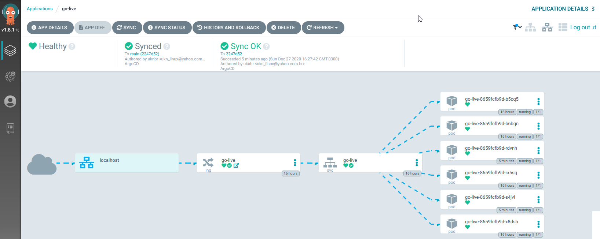
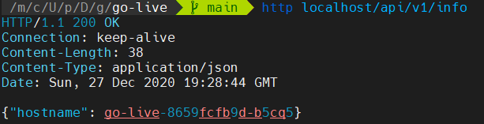
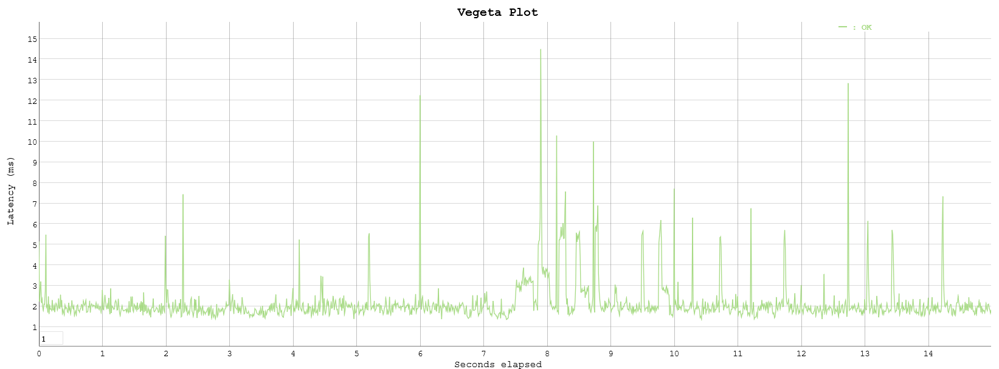

## Playground

### Components
- [WSL2](https://docs.microsoft.com/en-us/windows/wsl/install-win10)
- [Docker](https://www.docker.com/products/docker-desktop)
- [Kind](https://kind.sigs.k8s.io/)
- [Simple API](https://golang.org/)
- [Vegeta](https://github.com/tsenart/vegeta)

### Getting started
1. Clone repository
2. Start Cluster

```bash
./cluster.sh
```

3. Build & Load image

```bash
cd app/api && make build
kind --name local load docker-image localhost/go-live:0.0.5
```

### CD

Simple CD with [ArgoCD](https://argoproj.github.io/argo-cd/)

Setup

```bash
# Create namespace
kubectl create namespace argocd

# Deploy Argo manifests
kubectl apply -n argocd -f https://raw.githubusercontent.com/argoproj/argo-cd/stable/manifests/install.yaml

# Wait for deployment
kubectl wait --namespace argocd --for=condition=Ready pod --selector=app.kubernetes.io/name=argocd-repo-server --timeout=180s
````

Security

```bash
# Credentials
export argo_user=admin
export argo_pass=$(kubectl get pods -n argocd -l app.kubernetes.io/name=argocd-server -o name | cut -d'/' -f 2)

# Disable Web auth (optional)
kubectl patch deploy argocd-server -n argocd -p '[{"op": "add", "path": "/spec/template/spec/containers/0/command/-", "value": "--disable-auth"}]' --type json

# Forward port
kubectl port-forward svc/argocd-server -n argocd 9999:80
````

- Declarative

```terminal
kubectl apply -f cd/proj.yml
kubectl apply -f cd/app-echo.yml
kubectl apply -f cd/app-api.yml
```

- CLI

```terminal
argocd login localhost:9999 --insecure --username ${argo_user} --password ${argo_pass}
argocd app list
argocd app get api
argocd app sync api
```

- UI




### Test



API load test with [Vegeta](https://github.com/tsenart/vegeta)

```bash
echo "GET http://localhost/api/v1/info" | vegeta attack -rate=100/s -duration=15s | tee results.bin | vegeta report
cat results.bin | vegeta plot > report.html
```

